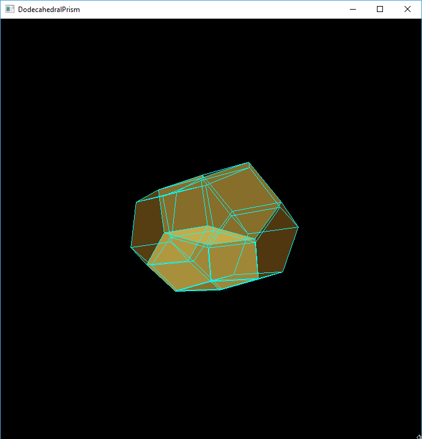

## Academic Project (Advanced Analysis of Algorithms) Mar 2018

Project to draw 4D objects (polytops).

### Background

Ever noticed that our computer screens are 2D (no depth), but we can see 3D pictures on it. That's because a 3D picture is projected to 2D. Why not do the same with 4D? This project projects 4D objects to 3D then projects 3D to 2D.

That sounds amazing but it is difficult to comprehend these objects. See for yourself below, only people with very high spatial capability can comprehend 4d!

### Control
* To rotate the polytope use keys 'wasd' 
* To exit press escape

### Requirements
* python3
* numpy: for ubuntu 'sudo apt-get install python3-numpy`
* pyopengl: for ubuntu 'sudo apt-get install python3-opengl'

Note: if installing pyopengl on Windows, there is some problem with the latest version. To run it on Windows, use a previous version.

### Running
Simply execute main.py with the path to one of the file in inputFiles. For example 'python main.py ./inputFiles/cell8.txt'

